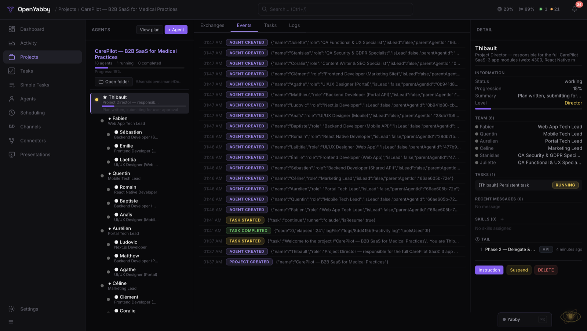
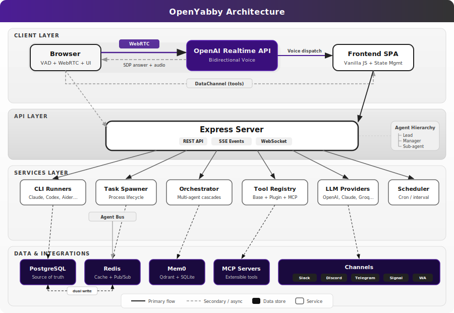

<p align="center">
  
</p>

<h1 align="center">OpenYabby</h1>

<p align="center">
  <strong>Open-source voice-driven agent system for building real projects on your Mac.</strong><br>
  Start a conversation, describe what you want, and OpenYabby plans, delegates, builds, reviews, and ships work through coordinated AI agents — across voice, web chat, and messaging channels like WhatsApp.
</p>

<p align="center">
  <a href="#demo">Demo</a> •
  <a href="#why-openyabby">Why OpenYabby</a> •
  <a href="#quick-start">Quick Start</a> •
  <a href="#what-it-can-do">What It Can Do</a> •
  <a href="#whatsapp-but-agent-native">WhatsApp</a> •
  <a href="#security--safety">Security</a> •
  <a href="#architecture">Architecture</a> •
  <a href="#connectors">Connectors</a> •
  <a href="#troubleshooting">Troubleshooting</a> •
  <a href="#faq">FAQ</a> •
  <a href="#development">Development</a> •
  <a href="#contributing">Contributing</a> •
  <a href="https://discord.gg/rpUMhCeEUS">Discord</a> •
  <a href="#roadmap">Roadmap</a> •
  <a href="#license">License</a>
</p>

<p align="center">
  
  <a href="https://discord.gg/rpUMhCeEUS"></a>
  
  
  
  
</p>

<p align="center">
  <strong><a href="https://openyabby.com/">openyabby.com</a></strong>
</p>

---

## Demo

<p align="center">
  
</p>

<p align="center">
  <em>Speak once, get a coordinated team. Plan → delegate → execute → review → report.</em>
</p>

<p align="center">
  
</p>

---

## How It Works

OpenYabby is designed around one loop:

1. You say **"Yabby"** once to start
2. You describe the project or task
3. OpenYabby plans the work, spins up the right agents, executes, reviews, and reports back live

---

## Why OpenYabby

Most AI tools stop at one layer: chat, voice, coding, automation, or agents.

OpenYabby combines them into a single open-source system that can handle larger, multi-step work.

What makes it different:

- **Voice-driven**: start with conversation, not forms or prompts
- **Project-scale orchestration**: break work into planning, execution, review, and QA phases
- **Multi-agent teamwork**: create lead, manager, and sub-agent workflows
- **Mac-native execution**: run real local tasks — bash, Python, Node, AppleScript, GUI automation — not just text generation
- **WhatsApp-native agent threads**: spawn standalone agents and talk to them directly in dedicated threads
- **Open-source and hackable**: inspect, modify, self-host, and extend everything
- **Persistent memory**: carries context across sessions — remembers your name, preferences, and project history

---

## What Is OpenYabby?

OpenYabby is an open-source AI assistant and agent orchestration system.

It starts as a voice or chat interface, but the real value is what happens next: it can turn a request into a structured workflow, assign work across coordinated agents, use tools, execute tasks on your machine, and keep track of context across the lifecycle of a project.

It can also move those workflows into messaging surfaces. On WhatsApp, OpenYabby can create standalone agents, open a dedicated thread for each one, and let you talk to that agent directly.

Under the hood, it combines:

- **OpenAI Realtime API** (WebRTC) for bidirectional voice
- **CLI task runners**: Claude Code (default), Codex, Aider, Goose, Cline, or Continue
- **Hierarchical multi-agent orchestration** for complex project workflows
- **Persistent memory** with Mem0 + Qdrant
- **37 connectors** (30 active today) and MCP server support for external tools
- **A local web app plus messaging channels** for interaction from multiple surfaces

---

## Who It's For

- Developers who want a voice-first system that can build and coordinate real projects
- Builders who want an open-source alternative to closed AI assistants
- Power users who want one assistant across coding, research, planning, and execution
- Tinkerers who want to customize agents, prompts, runners, tools, and workflows

If you want a minimal consumer voice app, this is probably too much. If you want a serious, hackable assistant system that can take on bigger jobs, this is what it's built for.

---

## Quick Start

### Prerequisites

| Requirement | Version |
|-------------|---------|
| Node.js | 20+ |
| Docker | Recommended — provides PostgreSQL 16 + Redis 7 via `./setup.sh` |
| PostgreSQL | 14+ (only if you opt out of Docker via `./setup.sh local`) |
| Redis | 6+ (only if you opt out of Docker via `./setup.sh local`) |
| Claude CLI | `npm i -g @anthropic-ai/claude-code` |
| OpenAI API key | Realtime API access |

> ⚠️ **OpenAI Realtime API is required for chat.** OpenYabby's chat path...
> (full text above)

> ⚠️ **Claude CLI must be on `PATH` for task execution.**...
> (full text above)

### One-Command Setup

### One-Command Setup

```bash
git clone https://github.com/OpenYabby/OpenYabby.git
cd OpenYabby
./setup.sh              # checks prereqs, installs deps, starts PG+Redis, launches server
# -> http://localhost:3000
```

The setup script handles everything: prerequisites check, `npm install`, `.env` creation (prompts for your OpenAI API key), infrastructure startup, and server launch. `./setup.sh` (no arg) defaults to **Docker mode** — Yabby's Postgres + Redis run in containers on non-default ports (`5433` / `6380`) so they never collide with your own local services. Pass `./setup.sh local` if you'd rather point Yabby at your own Postgres + Redis (you'll need to edit `.env` to match).

**Optional add-ons** (auto-skip with a clear notice if requirements aren't met):

- **Image generation** — Apple Silicon only, requires Python 3.10+ and ~8 GB free disk. The `generate_image` tool is unavailable on Intel/Linux/old-Python; `[ImageGen] ⏭ Skipped: ...` appears in the logs explaining why.
- **Speaker verification** — voice biometric filtering. Requires Python 3.10+. Wake word still works without it (fail-open).

### Manual Setup

```bash
npm install
cp .env.example .env    # fill in your API keys
npm run dev             # starts Node (port 3000) + Speaker service (port 3001)
```

Migrations run automatically. Open `http://localhost:3000`, say **"Yabby"**, and start giving it work.

### Try These Prompts

Once it's running, try one of these:

- "Introduce yourself and explain how you work."
- "Create a project plan for a startup landing page."
- "Build a simple HTML landing page for a bakery."
- "Research the latest news about OpenAI and summarize it."
- "Remember that I prefer TypeScript and short commit messages."
- "Split this into frontend and backend workstreams."
- "Create a standalone research agent in WhatsApp and let me talk to it directly."

### Environment Variables

<details>
<summary>Required</summary>

| Variable | Description |
|----------|-------------|
| `OPENAI_API_KEY` | OpenAI (Realtime API, Whisper, Mem0) |
| `PG_HOST` / `PG_PORT` / `PG_DATABASE` / `PG_USER` / `PG_PASSWORD` | PostgreSQL |
| `REDIS_URL` | Redis connection string |

</details>

<details>
<summary>Optional</summary>

| Variable | Description | Default |
|----------|-------------|---------|
| `CLAUDE_CMD` | Path to Claude CLI | `claude` |
| `PORT` | Server port | `3000` |
| `SPEAKER_SERVICE_URL` | Speaker verification service | `http://localhost:3001` |
| `SPEAKER_THRESHOLD` | Voice similarity threshold (0.0-1.0) | `0.25` |
| `YABBY_SECRET` | Encryption key for credentials | derived from `OPENAI_API_KEY` |
| `SANDBOX_ROOT` | Project sandbox location | `~/Desktop/Yabby Projects` |
| `TASKS_FORWARD_URL` | Forward tasks to remote agent (Docker) | - |

</details>

---

## Security & Safety

OpenYabby is powerful because it can execute real commands and access real tools. That also means it should be used carefully.

- **It can execute local system commands with broad machine access.**
- Authentication is optional and **disabled by default**. Enable auth before exposing any remote access.
- Do not expose `localhost:3000` directly to the public internet.
- Use least-privilege credentials for connectors and rotate tokens regularly.
- Review sensitive actions, especially when using autonomy features.

This project should be treated more like a local automation framework than a harmless toy app.

---

## What It Can Do

### 1. Turn a request into a real project workflow

OpenYabby is built for more than one-shot prompts. It can take a bigger goal, break it into stages, and run a structured lifecycle:

```
Discovery -> Planning -> Execution -> Review -> QA
     ^                                      |
     +-- User approves/revises plan --------+
```

The lead agent submits a plan for your approval. You approve, revise with feedback, or cancel. Approved plans trigger execution across the agent team.

### 2. Coordinate multiple agents

For larger jobs, OpenYabby creates role-based agent teams:

```
Lead Agent
+-- Frontend Manager
|   +-- UI Developer
|   +-- QA Tester
+-- Backend Manager
    +-- API Developer
    +-- Database Designer
```

A lead agent delegates work, managers coordinate their sub-teams, sub-agents execute and report back. When a sub-agent finishes, the orchestrator automatically triggers the parent for review. Tasks at the same level run in parallel; the next level waits until all current tasks complete.

### 3. Execute real tasks on your Mac

Each task spawns a real CLI process with full system access through supported runners:

| Runner | CLI | Status |
|--------|-----|--------|
| Claude Code | `claude -p ...` | Default |
| OpenAI Codex | `codex ...` | Supported |
| Aider | `aider ...` | Supported |
| Goose | `goose ...` | Supported |
| Cline | `cline ...` | Supported |
| Continue | `continue ...` | Supported |

Tasks can use bash, Python, Node, file system access, web browsing, AppleScript, and GUI automation. This is not just a talking assistant — it is an execution system.

### 4. Talk and respond by voice

Say the wake word **"Yabby"** and speak naturally. The voice stack uses WebRTC with the OpenAI Realtime API for low-latency, bidirectional audio. Wake word detection runs locally with Silero VAD + ONNX, with server-side Whisper confirmation.

Optional **speaker verification** (SpeechBrain ECAPA-TDNN) helps reduce false activations in shared environments. Enroll in 30 seconds via Settings.

### 5. Keep memory across sessions

Facts are extracted from conversation every 6 turns, stored in Qdrant (vector DB), and injected into every session. OpenYabby remembers your name, coding preferences, project context, recurring tasks, and tool usage patterns.

### 6. Use connectors and external tools

30 active connectors across GitHub, Notion, Gmail, Google Calendar, PostgreSQL, MongoDB, Puppeteer, Playwright, Brave Search, and more. Connectors use two backends: built-in (native JS) and MCP (Model Context Protocol servers).

### 7. Work across multiple channels

All channels share the same conversation context, tools, and memory:

| Channel | Adapter | Notes |
|---------|---------|-------|
| **Web** | Built-in | Voice + chat UI at `localhost:3000` |
| **WhatsApp** | Baileys | Standalone agents with dedicated threads |
| **Discord** | discord.js | Text + voice messages |
| **Slack** | Bolt | Socket mode, text + voice |
| **Telegram** | grammY | Text + voice notes |
| **Signal** | signal-cli | Text + voice messages |

---

## WhatsApp, but Agent-Native

On WhatsApp, OpenYabby can do more than reply in chat.

It can spawn standalone agents automatically, create a dedicated thread for each one, and let you talk to that agent directly.

That means you can:

- Create specialist agents from a conversation
- Keep agent work separated by thread
- Talk directly to a frontend, backend, research, or QA agent
- Coordinate larger projects from an app you already use
- Keep the same broader context across web, voice, and messaging

<!-- NEED TO DO: Add screenshot or GIF of WhatsApp agent thread in action -->

This is one of the clearest ways OpenYabby feels different from a standard chatbot or generic agent framework.

---

## What Works Today

Current core capabilities:

- Wake word + voice interaction (WebRTC bidirectional audio)
- Web chat UI with real-time activity feed
- Task execution with 6 CLI runners (Claude Code default)
- Multi-agent project orchestration with plan approval flow
- Persistent memory across sessions (Mem0 + Qdrant)
- 30 active connectors + MCP server support
- Multi-channel messaging (WhatsApp, Discord, Slack, Telegram, Signal)
- Scheduling and automation (cron, interval, manual triggers)
- Speaker verification for wake word filtering
- Configuration hot-reload (no restart needed)
- 9-step onboarding wizard for first run

---

## Architecture

<p align="center">
  
</p>

### Key Patterns

| Pattern | How |
|---------|-----|
| **Dual-write** | PG (source of truth) + Redis cache (24h TTL). Read: Redis -> PG fallback -> re-cache |
| **Soft delete** | `status = 'archived'`, never hard `DELETE` |
| **Real-time events** | SSE + WebSocket with identical payloads |
| **Wake word pipeline** | Client VAD -> Whisper confirmation -> activation |
| **GUI lock** | Redis hash with TTL for serialized GUI tasks |
| **Name resolution** | ID -> exact name -> ILIKE -> fuzzy match -> word match -> role match |

---

## Connectors

<details>
<summary>Full connector catalog (37 total, 30 active)</summary>

**Development:** GitHub, Linear, Sentry, Git, Jira, Confluence, Trello, Todoist

**Communication:** Slack, Slack MCP, Discord (via channel adapter)

**Productivity:** Notion, Figma, Google Calendar, Google Maps, Gmail, Outlook, YouTube Transcript

**Data:** PostgreSQL, MongoDB, MySQL, Supabase, Filesystem

**Web & Search:** Brave Search, Web Fetch, Puppeteer, Chrome DevTools, Playwright

**AI & Reasoning:** Sequential Thinking, Memory, EverArt

</details>

### Adding a Connector

```
Settings -> Connectors -> Add Connector -> pick from catalog -> enter credentials -> connect
```

For MCP servers:

```
Settings -> Connectors -> Custom MCP -> name + command + args -> connect
```

Connected tools automatically appear in voice and chat sessions.

---

## Speaker Verification (Optional)

A Python FastAPI microservice using SpeechBrain's ECAPA-TDNN model to verify that only your voice triggers the wake word. Helps reduce false activations in shared environments.

```bash
# Starts automatically with:
npm run dev

# Or manually:
cd speaker && pip install -r requirements.txt && uvicorn app:app --port 3001
```

**Enrollment:** Settings -> Speaker Verification -> record 3 samples saying "Yabby" -> done.

The service is fail-open: if it's down, voice detection continues without speaker filtering.

---

## Docker

```bash
docker-compose up   # starts PostgreSQL + Redis
npm start           # start OpenYabby locally
```

> **Note:** Claude CLI requires host access for task execution, so Docker is best used for infrastructure services while OpenYabby runs on the host. Alternatively, set `TASKS_FORWARD_URL` to forward task spawns to a local agent.

---

## Mobile Access (Relay Tunnel)

The relay tunnel proxies HTTP + WebSocket traffic to your localhost via `relay.openyabby.com` so a remote client can reach your machine. It's off by default. To enable, set a `RELAY_SECRET` in your `.env` (request one from the project maintainers, or run your own relay):

```bash
RELAY_SECRET=your-relay-secret-here
```

A native mobile companion is on the [roadmap](#roadmap) — sign up at [openyabby.com](https://openyabby.com/) to get notified.

---

## Troubleshooting

Common issues and quick fixes. For deeper coverage see [docs/troubleshooting.md](docs/troubleshooting.md).

| Symptom | Likely cause | Fix |
|---|---|---|
| `EADDRINUSE: port 3000` on startup | A previous Node instance is still bound | `lsof -ti :3000 \| xargs kill` then `npm start` |
| `Claude CLI not found` in spawner logs | CLI not on `PATH`, or installed under a different name | `npm i -g @anthropic-ai/claude-code`, or set `CLAUDE_CMD=/full/path/to/claude` in `.env` |
| `ECONNREFUSED 127.0.0.1:5433` (or `:5432` in local mode) | PostgreSQL container/service is not running | `./setup.sh docker` to start, or verify `PG_HOST`/`PG_PORT` in `.env` match your local Postgres |
| `role "..." does not exist` on startup | App is talking to the wrong Postgres (e.g. brew Postgres on 5432 without a `yabby` role) | `./setup.sh docker` (recommended), or create the role manually: `createuser -s yabby && createdb -O yabby yabby` |
| `ECONNREFUSED 127.0.0.1:6380` (or `:6379` in local mode) | Redis container/service is not running | `./setup.sh docker`, or `brew services start redis` and set `REDIS_URL=redis://localhost:6379` in `.env` |
| `[ImageGen] ⏭ Skipped: ...` in dev logs | Imagegen preflight failed (non-Apple-Silicon, Python <3.10, low disk, or offline) | Optional — fix the reason shown in the skip line, or ignore if you don't need local image generation |
| Wake word never triggers | Speaker service is off, or you haven't enrolled | Service is **fail-open** (still works without it). Run `npm run speaker` and enroll via the UI for biometric filtering |
| Tunnel won't connect to `relay.openyabby.com` | No `RELAY_SECRET`, or you don't want a tunnel | Set `DISABLE_TUNNEL=true` in `.env` to silence; the app runs fine locally without it |
| Tasks pause with status `paused_llm_limit` | Claude CLI hit its daily quota | Yabby auto-resumes after the reset window. See [migration 024](db/migrations/024_llm_limit_tasks.js) for the persisted resume metadata |
| Server crashes with V8 heap warnings | Heap monitor needs `--expose-gc` to free memory | Always launch via `npm start` (which already passes `--max-old-space-size=8192 --expose-gc`); never run `node server.js` directly |
| Voice cuts out or feels laggy | WebRTC NAT/firewall, or browser mic permission | Test in Chrome on the same network as the server; check browser site-permissions for microphone |

When opening a bug report, include the relevant lines from `logs/{taskId}-activity.log` and `logs/{taskId}-raw.log` if it's a task issue, or the browser console + network tab if it's a voice issue.

---

## FAQ

**Why is OpenYabby Mac-only today?**
The CLI runners drive real local automation — bash, AppleScript, GUI control — and the prompt set assumes macOS conventions. Cross-platform is on the [roadmap](#roadmap); contributions to the Linux/Windows story are welcome.

**Can I use Ollama or a local model instead of OpenAI?**
Yes — for the LLM provider layer (channel handlers, hallucination detection, memory extraction). Configure `llm.provider` to `ollama` in your config. **The voice pipeline still requires OpenAI's Realtime API** for now; voice-on-local-models is on the roadmap and PRs are welcome.

**Do I need the Claude CLI?**
Claude is the default runner, but OpenYabby is runner-agnostic. You can switch to Codex, Aider, Goose, Cline, or Continue in [lib/runner-profiles.js](lib/runner-profiles.js) — see [docs/runners.md](docs/runners.md) for the trade-offs.

**Is my voice data stored?**
Audio frames stream through WebRTC and are not persisted. Whisper transcripts and Mem0-extracted facts (name, preferences, project history) are stored locally in Postgres + the file-based Qdrant index (`memory.db`). Nothing leaves your machine except the live calls to OpenAI/Claude/your configured providers.

**How do I add a new channel, connector, or runner?**
See [CONTRIBUTING.md](CONTRIBUTING.md) — there's a recipe for each. Channels subclass `ChannelAdapter`; connectors extend the catalog in [lib/connectors/catalog.js](lib/connectors/catalog.js); runners register in [lib/runner-profiles.js](lib/runner-profiles.js).

**Can I run it in Docker?**
Postgres + Redis run great in Docker (`./setup.sh docker`). The Node server *can* run in Docker, but the Claude CLI cannot — use `TASKS_FORWARD_URL` to forward task spawns back to a host agent if you want a containerized web/channel layer.

---

## Limitations

- macOS-first execution model (AppleScript/GUI automation assumptions)
- Setup is heavier than a single-binary app — requires PostgreSQL, Redis, and API keys
- Some channels and connectors require third-party credentials
- Speaker verification depends on the optional Python service
- Autonomous execution still requires human judgment for sensitive tasks

---

## Development

### Project Structure

```
server.js                 Express app, WebRTC session, startup
lib/
  spawner.js              CLI process lifecycle + log parsing
  prompts.js              System prompts (voice, lead, manager, sub-agent)
  memory.js               Mem0 integration
  orchestrator.js         Auto-trigger parent review
  config.js               Zod-validated config + hot-reload
  scheduler.js            Cron/interval task scheduling
  channels/               Channel adapters
  connectors/             Connector catalog + lifecycle manager
  mcp/                    MCP server bridge
  plugins/                Plugin loader + tool registry
  providers/              LLM providers
  tts/                    TTS engines
routes/                   Express routers
db/
  migrations/             Auto-run migrations (idempotent)
  queries/                PG + Redis data access
public/                   Vanilla JS SPA (no build step)
speaker/                  Python speaker verification service
tests/                    Vitest + Playwright
```

### Running Tests

```bash
# Unit tests (mocks PG/Redis, no DB needed)
npx vitest

# E2E tests (requires server running on port 3000)
npm run test:e2e            # headless
npm run test:e2e:headed     # with browser
npm run test:e2e:ui         # Playwright UI mode
```

### Adding a Migration

1. Create `db/migrations/0XX_name.js` exporting `MIGRATION` SQL + `run()` async function
2. Add the filename to the explicit array in `server.js` `startup()`
3. Migrations are idempotent (`IF NOT EXISTS` / `ON CONFLICT`)

### Adding a Plugin

1. Create `plugins/my-plugin/plugin.json` (manifest)
2. Create `plugins/my-plugin/index.js` exporting `init(context)`
3. Context provides: `config`, `logger`, `registerTool()`, `eventBus`, `registerRoutes()`
4. Tools auto-prefixed with plugin name

---

## Contributing

Contributions are very welcome — bugs, features, docs, new connectors, new runners, new channels.

1. Read [CONTRIBUTING.md](CONTRIBUTING.md) for the full setup, test, and recipe guides (how to add a migration / connector / runner / channel / plugin).
2. Read [CODE_OF_CONDUCT.md](CODE_OF_CONDUCT.md) — Contributor Covenant 2.1.
3. For security issues, follow [SECURITY.md](SECURITY.md) (private disclosure via GitHub Security Advisories).
4. Conventional commits (`feat(scope): ...`, `fix(scope): ...`, `docs: ...`, `chore: ...`) — match the existing `git log`.

### Conventions

- ES modules throughout (`import`/`export`, `.js` extensions)
- Locale support for `fr`, `en`, `es`, `de`
- Soft-delete (`status = 'archived'`) — never hard `DELETE`
- Redis keys follow `yabby:{entity}:{id}:{field}`
- No build step for frontend — vanilla JS from `public/`

---

## End-to-End Example: Building a Quantum Computing + AI SaaS

This walkthrough shows how OpenYabby handled a full SaaS build -- from a voice request to a working platform with auth, dashboards, billing, and a quantum circuit simulator.

<details>
<summary>Full project timeline</summary>

### The Request

> "build me a full SaaS for quantum computing and AI where users can design quantum circuits visually run simulations train hybrid quantum ML models and manage everything from a dashboard with team collaboration and billing"

### Phase 1: Discovery (8 min)

The lead agent **Margaux** submitted 9 discovery questions mixing voice prompts and structured forms:

- Target users? **Researchers, quantum engineers, and AI teams at startups and universities**
- Core modules? **Circuit designer (drag-and-drop), simulator (up to 20 qubits), hybrid ML pipeline builder, experiment tracker, team workspaces**
- Tech stack preference? **Next.js 14 + TypeScript, Supabase (auth + DB + storage), Stripe billing, Vercel deploy**
- Quantum simulation backend? **Browser-based for small circuits (< 8 qubits via WebAssembly), server-side for larger (Python Qiskit via API)**
- Pricing model? **Free tier (5 qubits, 100 sim/month), Pro ($49/mo, 15 qubits, unlimited), Enterprise (custom)**
- Collaboration features? **Shared workspaces, circuit versioning, experiment comments, role-based access (owner/editor/viewer)**
- Design direction? **Dark mode default, tech-forward -- deep navy/purple gradients, cyan accents, monospace code fonts. Inspirations: IBM Quantum, Pennylane, Weights & Biases**
- Auth requirements? **Email + Google OAuth, magic links, 2FA for Enterprise**
- Compliance? **SOC 2 awareness, data residency labels, audit log**

### Phase 2: Planning (5 min)

Margaux wrote a `PLAN.md` (18,000+ characters) covering:

- **Architecture**: Next.js 14 App Router, TypeScript strict mode, Supabase (Auth + Postgres + Realtime + Storage), Stripe Connect, WebAssembly quantum simulator, Python Qiskit microservice
- **Data model**: 14 tables -- users, workspaces, workspace_members, circuits, circuit_versions, simulations, simulation_results, experiments, experiment_runs, models, datasets, billing_subscriptions, usage_log, audit_log
- **Design system**: Dark navy palette (`#0a0e27` base, `#1e3a5f` surface, `#00d4ff` accent cyan, `#7c3aed` accent purple), JetBrains Mono for code, Inter for UI
- **12 milestones** (M1-M12), **team of 7 agents**

Plan submitted for review. User approved with one note: "Add a public landing page with interactive demo."

### Phase 3: Team Creation & Execution

Margaux created 7 sub-agents and delegated the first wave of tasks in parallel:

| Agent | Role | First Assignment |
|-------|------|-----------------|
| **Raphael** | Architect & Infrastructure | Next.js scaffolding, Supabase schema (14 tables + RLS), CI config |
| **Camille** | Frontend Lead | Design system (Tailwind tokens, 22 UI components), layout system |
| **Antoine** | Quantum Engine Dev | WebAssembly simulator (state vector, gates library, measurement) |
| **Lena** | Full-Stack Dev | Auth flow (email + Google + magic links), workspace CRUD, role-based middleware |
| **Nathan** | Backend / API Dev | Simulation API, job queue, Qiskit bridge, results caching |
| **Elise** | Dashboard & Visualization | Circuit designer (drag-and-drop canvas), Bloch sphere, histogram charts |
| **Victor** | QA & Security | Playwright test framework, OWASP checklist, penetration test plan |

### Phase 4: Review Cycles (multiple rounds)

Margaux reviewed every deliverable with code inspection and live browser testing via Playwright:

- **Raphael's schema**: 14 tables with RLS tested via cross-workspace queries -- 0 leaks. One fix: missing cascade delete on circuit_versions
- **Camille's design system**: 22 components screenshotted at 4 viewports. "The dark theme with cyan accents feels like a real quantum computing product"
- **Antoine's quantum engine**: Bell state circuit tested -- verified 50/50 measurement. 8-qubit GHZ state in 12ms
- **Lena's auth**: Full flow tested live (signup, OAuth, magic link, session, roles). Editors correctly blocked from workspace deletion
- **Nathan's simulation API**: 12-qubit Grover search submitted, WebSocket progress verified, results matched expected probability amplification
- **Elise's circuit designer**: 5-qubit QFT built visually, QASM export/import round-trip confirmed. Wire routing handles crossing correctly

Subsequent milestones delegated after reviews: hybrid ML pipeline builder, experiment tracker, Stripe billing, landing page with interactive demo, real-time collaboration, and final integration.

### Phase 5: QA & Security Review

**Victor** delivered a security audit (OWASP Top 10 + 12 penetration test scenarios), 127 Playwright E2E specs across auth, circuits, simulator, billing, collaboration, API, accessibility, and performance. **Camille** produced a design review with 48 screenshots (12 pages x 4 viewports) surfacing 3 blocking mobile issues -- all fixed and re-verified. Final build: 47 pages, 0 errors, 0 type errors, `npm audit` clean. Lighthouse weighted average: Performance 94, Accessibility 98, Best Practices 100, SEO 96.

### Outcome

| Metric | Value |
|--------|-------|
| Total tasks | 61 (58 succeeded, 3 required follow-up fixes) |
| Agents | 8 (1 lead + 7 sub-agents) |
| Development time | ~4 hours |
| Pages | 47 |
| Database tables | 14 with full RLS |
| Quantum gates | 12 |
| E2E tests | 127 Playwright specs |
| Security findings | 0 critical, 0 high |
| Lighthouse Performance | 94 |

All 5 phases exercised: Discovery, Planning, Execution, Review, and QA.

</details>

---

## Roadmap

Active focus areas. Open an [issue](https://github.com/OpenYabby/OpenYabby/issues) to suggest a new item or vote up an existing one.

- **Multi-voice system** — distinct voices per agent, simultaneous sessions
- **Full-time job agent** — always-on continuous research / long-horizon work
- **Native mobile companion** — iOS / Android over the relay tunnel ([sign up](https://openyabby.com/))
- **Starter templates** — SaaS, landing page, API service scaffolds
- **Safe execution mode** — restricted runner permissions for cautious / shared environments
- **Cross-platform** — reduce macOS-specific assumptions; first-class Linux and Windows story

---

## License

[MIT](LICENSE) © 2026 Idov Mamane

> **WhatsApp exception:** The optional WhatsApp adapter depends on [`@whiskeysockets/baileys`](https://github.com/WhiskeySockets/Baileys) which transitively includes `@whiskeysockets/libsignal-node` (GPL-3.0). This component is optional and not required for core functionality. If you redistribute with WhatsApp support, comply with GPL-3.0 for that component. See [THIRD_PARTY_LICENSES.md](THIRD_PARTY_LICENSES.md) for the full dependency license audit.
---

<p align="center">
  <sub>Built with unreasonable amounts of coffee and WebRTC debugging.</sub><br>
  <sub>If OpenYabby starts talking to your cat, that is probably still a feature.</sub>
</p>
